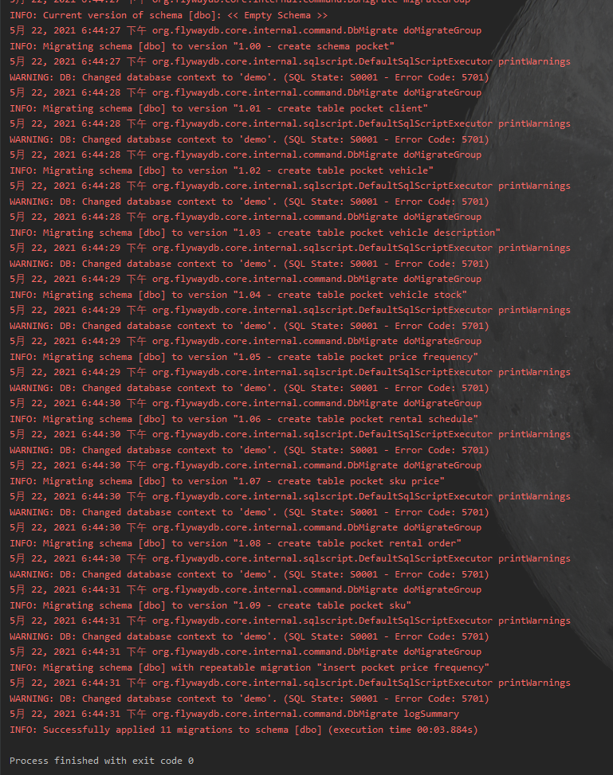
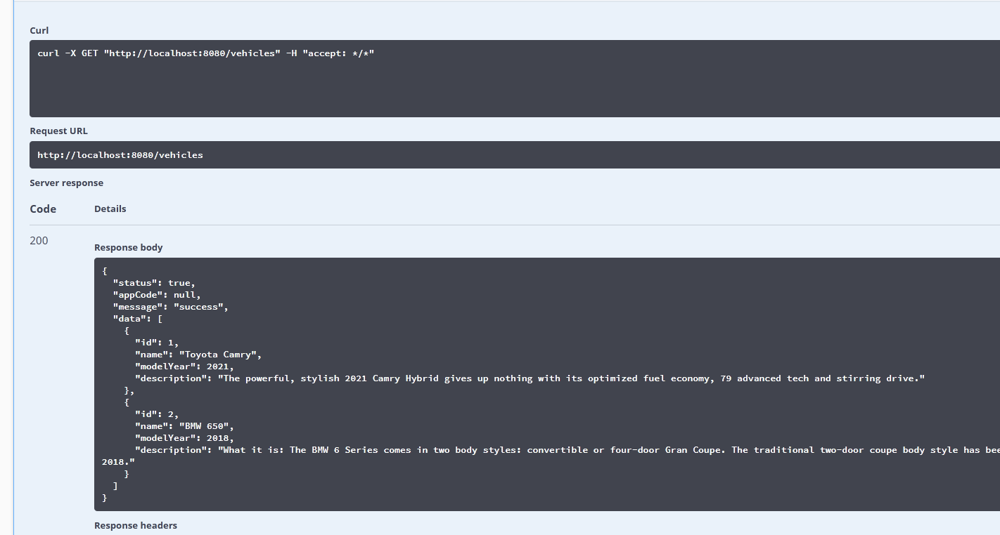
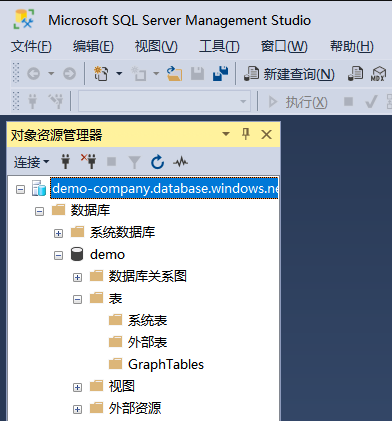

Deadline1：0:00 23/5/2021 

Deadline2：12:00 23/5/2021  10h 

Deadline3：24:00 23/5/2021  22h

# Doc 
## Free Resources
- https://portal.azure.com/#blade/Microsoft_Azure_Billing/FreeServicesBlade

## Server
- app-service: https://docs.microsoft.com/zh-cn/azure/app-service/quickstart-java?tabs=javase&pivots=platform-linux
- toolkit-for-intellij: https://docs.microsoft.com/zh-cn/azure/developer/java/toolkit-for-intellij/create-hello-world-web-app
- price: https://azure.microsoft.com/zh-cn/pricing/details/app-service/linux/

## Database     
- Azure SQL: https://azure.microsoft.com/zh-cn/products/azure-sql/database/
- NoSQL Azure Cosmos DB: https://azure.microsoft.com/en-us/services/cosmos-db/
- Draft table:

| pocket_client |      |         |            |           |               |
| ------------- | ---- | ------- | ---------- | --------- | ------------- |
| id            | name | contact | citizen_id | create_on | last_modified |

| pocket_vehicle |      |            |           |               |
| -------------- | ---- | ---------- | --------- | ------------- |
| id             | name | model_year | create_on | last_modified |

| pocket_vehicle_description |            |             |           |               |
| -------------------------- | ---------- | ----------- | --------- | ------------- |
| id                         | vehicle_id | description | create_on | last_modified |

| pocket_vehicle_stock |          |            |                   |                |           |               |
| -------------------- | -------- | ---------- | ----------------- | -------------- | --------- | ------------- |
| id                   | sku_guid | vehicle_id | service_day_count | free_day_count | create_on | last_modified |

| pocket_price_frequency |                 |           |               |
| ---------------------- | --------------- | --------- | ------------- |
| id                     | price_frequency | create_on | last_modified |

| pocket_rental_schedule |          |            |          |                |                 |           |               |
| ---------------------- | -------- | ---------- | -------- | -------------- | --------------- | --------- | ------------- |
| id                     | sku_guid | start_time | end_time | schedule_price | rental_order_id | create_on | last_modified |

| pocket_sku_price |          |                    |       |           |               |
| ---------------- | -------- | ------------------ | ----- | --------- | ------------- |
| id               | sku_guid | price_frequency_id | price | create_on | last_modified |

| pocket_rental_order |           |              |             |           |               |
| ------------------- | --------- | ------------ | ----------- | --------- | ------------- |
| id                  | client_id | signing_time | total_price | create_on | last_modified |

| pocket_sku          |           |              |       |           |               |
| ------------------- | --------- | ------------ | ----- | --------- | ------------- |
| id                  | sku_guid  | vehicle_id   | color | create_on | last_modified |

- flyway works

- swagger works (test API)

  

# Azure

- service: https://portal.azure.com/#blade/HubsExtension/BrowseResource/resourceType/Microsoft.Web%2Fsites
- DB: https://portal.azure.com/#blade/HubsExtension/BrowseResource/resourceType/Microsoft.Sql%2Fservers%2Fdatabases

# Swagger 
http://localhost:8080/swagger-ui.html

# API Design

## User Story with Priority

- [] sign up/sign in
- [] view the most popular sku

- [view all vehicle](https://github.com/ParrySMS/PocketRentalCompany/issues/11)

- [view all SKUs for one vehicle](https://github.com/ParrySMS/PocketRentalCompany/issues/12)

- [v] view available vehicle for selected rental period
- [v] choose one sku and show the price, change rental period and show the new price
- [v] add the {SKU + period} into order
- [v] show order
- [] view other SKU
- [] take an order, waiting paid
- [] call OtherAPI to finish payment

## API 

set the userID in the http header

GET  /vehicles?from={start_day}&end={end_day}

GET  /sku/{skuid}/price?from={start_day}&end={end_day}

POST /orders {body}
PUT /orders/{orderId}  {body}

GET /orders
