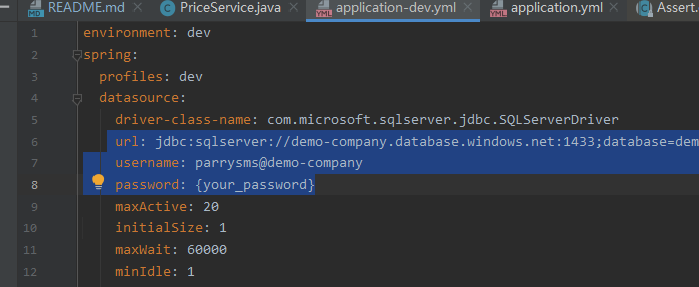
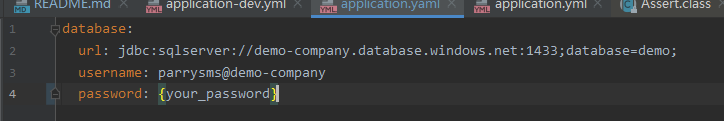
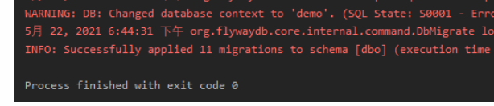
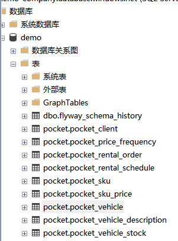
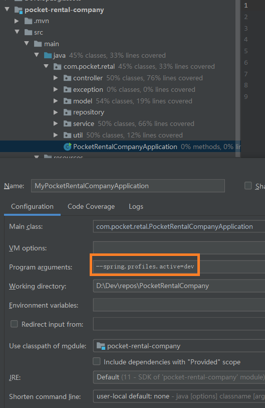
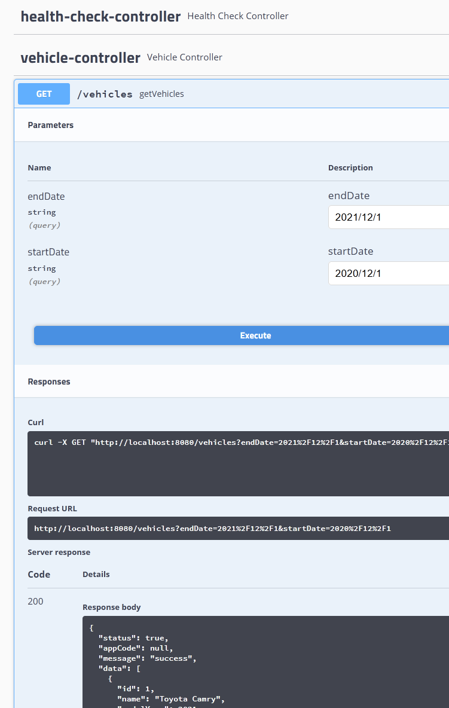
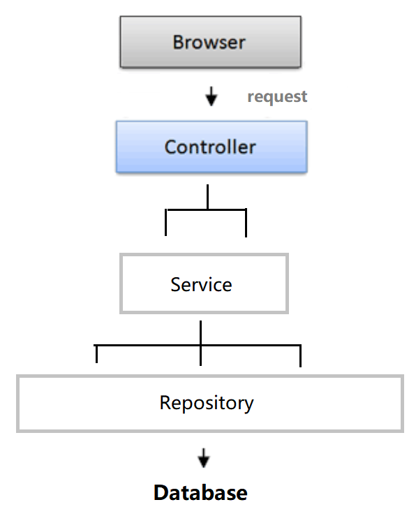
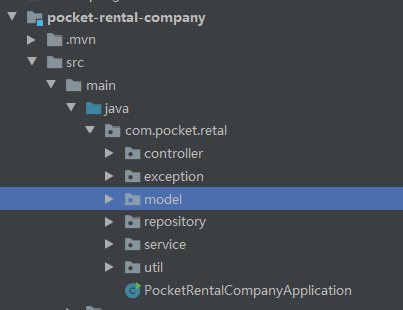
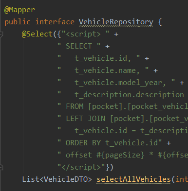
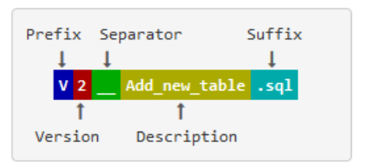

# PocketRentalCompany
Pocket, a new car rental company, help you rent a car to travel to the world.

[]()

Repository: https://github.com/ParrySMS/PocketRentalCompany

This repository contains:

1. The SpringBoot API project in `pocket-rental-company`
2. The Flyway project in `storage/db-sql-server` for database migration.

------

## Table of Contents


- [PocketRentalCompany](#pocketrentalcompany)
    - [Table of Contents](#table-of-contents)
    - [Background](#background)
    - [Install](#install)
        - [1 Fork this repository and clone to local](#1-fork-this-repository-and-clone-to-local)
        - [2 Install Lombok plugin](#2-install-lombok-plugin)
        - [3 Setup SQL Server config](#3-setup-sql-server-config)
        - [4 Migration for the Database](#4-migration-for-the-database)
        - [5 Run API project and view the swagger](#5-run-api-project-and-view-the-swagger)
    - [The SpringBoot API project](#the-springboot-api-project)
    - [The Flyway project](#the-flyway-project)
        - [Why we need](#why-we-need)
        - [How to use](#how-to-use)
            - [1. migrate to local for coding and debuging](#1-migrate-to-local-for-coding-and-debuging)
            - [2. Change the database through SQL](#2-change-the-database-through-sql)
            - [3. Try on your local database](#3-try-on-your-local-database)
            - [4. Commit migration to git](#4-commit-migration-to-git)
        - [No history should be changed](#no-history-should-be-changed)
        - [SQL-based migrations naming](#sql-based-migrations-naming)
            - [Versioned Migrations](#versioned-migrations)
            - [Repeatable Migrations](#repeatable-migrations)
    - [The difference of these migrations](#the-difference-of-these-migrations)
        - [Versioned Migrations](#versioned-migrations-1)
        - [Repeatable Migrations](#repeatable-migrations-1)


## Background

There is a new small car rental company called "Pocket". The Pocket need a series of software service to help people rent a car online.

The goals for this repository are:

1. Cross-platform API services for Website or App on smart phone.
2. A well-designed database to support the business.

## Install

**Java 11** and **SQL Server** are required for this project.

It is recommended that locally installed to you machine for coding and debugging.

### 1 Fork this repository and clone to local

You can switch to `develop` branch for the latest version repository.

### 2 Install Lombok plugin

 - For IDEA : File -> Settings -> Plugins -> Search "Lombok" -> install "Lombok plugin"

### 3 Setup SQL Server config

It is recommended that create your own configuration file in `\pocket-rental-company\src\main\resources\` and `\storage\db-sql-server\src\main\resources\`

You can also just intput your local or remote SQL Server configuration refer to the following files.

- `\pocket-rental-company\src\main\resources\application-dev.yml`



- `\storage\db-sql-server\src\main\resources\application.yaml`


### 4 Migration for the Database

Please make sure your SQL Server have a database called `demo` and the connection is stable.

Run the `Main` in the Flyway project `storage/db-sql-server` for database migration.

The Flyway will check your database migration version and run SQLs in `\storage\db-sql-server\src\main\resources\db\migration`.

You can find more details from the Flyway document.

[https://flywaydb.org/documentation/getstarted/why](https://flywaydb.org/documentation/getstarted/why)


After the program finish the database migration. You should view the INFO row as below.
`INFO: Successfully applied X migrations to xxxxxxx`


You will find your empty database have a migration to the latest project database.



### 5 Run API project and view the swagger

Build and run `com.pocket.retal.PocketRentalCompanyApplication`.

If you have your own profiles environment, please input into the `Program arguments`

`--spring.profiles.active=dev `




You can view you Swagger here: http://localhost:8080/swagger-ui.html#

All the APIs are work and executable in the webpage.




## The SpringBoot API project

The construction for the API project is simple.






The repository use class persistence framework **MyBatis** support for SQL Server




## The Flyway project

Document : https://flywaydb.org/documentation/

How Flyway works : https://flywaydb.org/getstarted/how


### Why we need 

- **consider the database sql as the code**
- **make sure all coder know what happened in the database to avoid bug because of change in the table**
- version control and sql review
- keep all coder own the local database as same as non-prod/prod to debug
- if you change database,it consider as commit your code.

### How to use

#### 1. migrate to local for coding and debuging

- Build your local database
- Please put your local config by using Main params or `application.yaml` .
- Run this project to migrate non-prod/prod database to your local database.

#### 2. Change the database through SQL

- Please read the **SQL-based migrations naming** below or flyway document before you write an sql file.
- 
- write or export sql in new file. Here is some examples.

----------
**versioned migrations: **

- create or alter something  

**V1.21__Add_table_test_data.sql**

```sql
CREATE TABLE Customers (
CustomerId smallint identity(1,1),
Name nvarchar(255),
Priority tinyint
)
CREATE TABLE Sales (
TransactionId smallint identity(1,1),
CustomerId smallint,
[Net Amount] int,
Completed bit
)
GO
```
----------


**repeatable migrations:**

- (Re-)creating views/procedures/functions/packages..  
- or bulk reference data reinserts

**R__Insert_pocket_price_frequency_mock_data.sql**

```sql
USE [demo]
GO

TRUNCATE TABLE [pocket].[pocket_price_frequency]

INSERT [pocket].[pocket_price_frequency] (frequency_type, create_on, last_modified) VALUES ('Daily', GETDATE(), GETDATE())
GO
```
----------

**undo something:  ** (We do not use Undo Migrations because it need money)

- use V to commit new vesion.  

**V1.22__Delete_table_test_data.sql**  

```sql
DROP TABLE `mydb`.`test_data`;
```
- check all related R sql

**R__Create_test_data_view.sql**

```
IF EXISTS `mydb`.`test_data`
BEGIN
CREATE OR REPLACE VIEW test_data_view AS 
    SELECT value FROM test_data WHERE text ='common';
END
```

----------

#### 3. Try on your local database

- Please fetch and pull the latest code to local.

- Please put your local config by using Main params or `application.yaml` .

- Run this project to migrate new change to your local database.

- **If there is error occur on V file, you may need to drop local database to rewrite V file.**

- Run API project and Import Manager project and try some case to make sure all project work after database changed.

#### 4. Commit migration to git

- other coder will review the sql in this migration project.

- build new jar to non-prod/prod after approval and run **(todo)**


### No history should be changed

- You should never change any sql file likes `V1__xxx` .  It is history in version.
- You could change  sql file likes `R__xxx`.  Instead of  `V__` file being run just once, they are  (re-)applied every time their checksum changes.
- If you really need to change history, please refer flyway repair. ([https://flywaydb.org/documentation/command/repair](https://flywaydb.org/documentation/command/repair))


### SQL-based migrations naming

[https://flywaydb.org/documentation/migrations#sql-based-migrations](https://flywaydb.org/documentation/migrations#sql-based-migrations)

In order to be picked up by Flyway, SQL migrations must comply with the following naming pattern:

#### Versioned Migrations



#### Repeatable Migrations


The file name consists of the following parts:

- Prefix: V for versioned (configurable), U for undo (configurable) and R for repeatable migrations (configurable)
- Version: Version with dots or underscores separate as many parts as you like (Not for repeatable migrations)
- Separator: __ (**two underscores**) (configurable)
- Description: Underscores or spaces separate the words
- Suffix: .sql (configurable)

**Please do not forget Separator is two underscores __**

Optionally versioned SQL migrations can also omit both the separator and the description.

## The difference of these migrations

[https://flywaydb.org/documentation/migrations](https://flywaydb.org/documentation/migrations)

We do not use Undo Migrations because it need money

### Versioned Migrations

The most common type of migration is a versioned migration. Each versioned migration has a version, a description and a checksum. The version must be unique. The description is purely informative for you to be able to remember what each migration does. The checksum is there to detect accidental changes. Versioned migrations are applied in order exactly once.

Versioned migrations are typically used for:

- Creating/altering/dropping tables/indexes/foreign keys/enums/UDTs/…
- Reference data updates
- User data corrections

### Repeatable Migrations

**Repeatable migrations** have a description and a checksum, but no version. Instead of being run just once, they are (re-)applied every time their checksum changes.

This is very useful for managing database objects whose definition can then simply be maintained in a single file in version control. They are typically used for

- (Re-)creating views/procedures/functions/packages/…
- Bulk reference data reinserts

Within a single migration run, repeatable migrations are always  applied last, after all pending versioned migrations have been executed.  Repeatable migrations are applied in the order of their description.

It is your responsibility to ensure the same repeatable migration can be applied multiple times. This usually involves making use of `CREATE OR REPLACE` clauses in your DDL statements.

